# StoryVerse

## Summary
StoryVerse is an application that aims to revolutionize collaborative storytelling with AI-assisted tools and video technologies. By integrating Livepeer's decentralized AI video processing capabilities, it provides an avenue for empowering storytellers and the community at large.

StoryVerse is a **social media app** that gives power to every individual, making everyone a **content creator**.

## Core Concept
StoryVerse is a decentralized application where users collaboratively create branching, interactive video stories. Each story starts with a seed video, and participants can contribute new branches, alternative endings, or parallel storylines using AI-generated content, human-created content, or a combination of both.

## Detailed Functionality

### 1. Story Initiation
- Users can start a new story by invoking ideas from LLMs to develop the story theme.
- The theme sets the stage for the story world and initial character design.

### 2. Collaborative Expansion
- Based on a user's story theme, plot, or characters, another user can create their own story, akin to the concept of a multiverse in today's movie industry.

### 3. AI-assisted Tools
- Livepeer's AI tools, ranging from text-to-image, image-to-image, image-to-video, and image upscaling, aid in the creation, conceptualization, refining, and building of the story from image to video.

## Extended Detailed Functionality
**Note:** While the implementation has solely utilized Livepeer, the original idea, which was not implemented, consists of the following functionality:

### 1. NFT Integration
- Using Zora, key story elements (characters, locations, plot points) can be minted as NFTs.
- NFT owners gain special privileges, such as the ability to veto changes to their owned elements or receive a larger share of revenues generated from their use.

### 2. Intellectual Property Management
- Story Protocol tracks the contribution of each creator to the overall narrative.
- Smart contracts automatically manage rights and royalties based on the usage and popularity of different story elements.

### 3. Monetization
- Revenue is generated through various streams:
  - Subscription access to the platform
  - Pay-per-view for premium story branches
  - NFT sales of story elements
  - Advertising integrated into the story world (if appropriate)
- Smart contracts automatically distribute revenue to contributors based on their level of involvement and the popularity of their contributions.

## Technical Implementation

### 1. Backend
- A Node.js server manages user interactions and coordinates between different services.
- Livepeer's AI API for all video processing tasks.
- MongoDB database for persistent storage of prompts aiding in story development and storage for stories.
- LLM model (using Groq).
- LangChain for handling chat interaction with LLMs. Chat histories are persisted to persistent storage (MongoDB).

### 2. Frontend
- A web-based interface built using Next.js, providing an intuitive way to navigate the stories, branching stories, and interact with the platform.

## Advantages

1. **Unprecedented Creativity:** The combination of human imagination and AI assistance allows for the creation of complex, engaging narratives that would be difficult to produce through traditional means.

2. **Engagement:** The interactive nature of the platform keeps viewers highly engaged, encouraging repeat visits and deep exploration of story worlds.

3. **Scalability:** Livepeer's decentralized video processing allows the platform to scale efficiently as it grows in popularity.

## Challenges and Solutions

### 1. Content Moderation
- **Challenge:** Ensuring appropriate content in a decentralized, collaborative environment.
- **Solution:** Implement a community-driven moderation system, supplemented by AI content analysis.

### 2. Narrative Coherence
- **Challenge:** Maintaining overall story quality and coherence with multiple contributors.
- **Solution:** Use SwarmZero AI agents to review and suggest improvements to maintain narrative consistency.

### 3. Technical Complexity
- **Challenge:** Integrating multiple advanced technologies seamlessly.
- **Solution:** Develop a robust API layer that abstracts the complexity of individual technologies, providing a unified interface for developers.

## Conclusion
StoryVerse represents a paradigm shift in collaborative storytelling, leveraging cutting-edge technologies to create a platform that is engaging, fair, and infinitely expandable. By combining the strengths of Livepeer, SwarmZero, Story Protocol, and Zora, we create a unique ecosystem that empowers creators, delights audiences, and pushes the boundaries of interactive entertainment.

## Running the Application

```sh
npm i
```

```sh
npm run dev
```

**Note:** Due to time constraints, the majority of the UI and some crucial functionalities were not successfully implemented, but a proof of its concept and flow of operation is attached here.

1. **Login / Signup Page**
   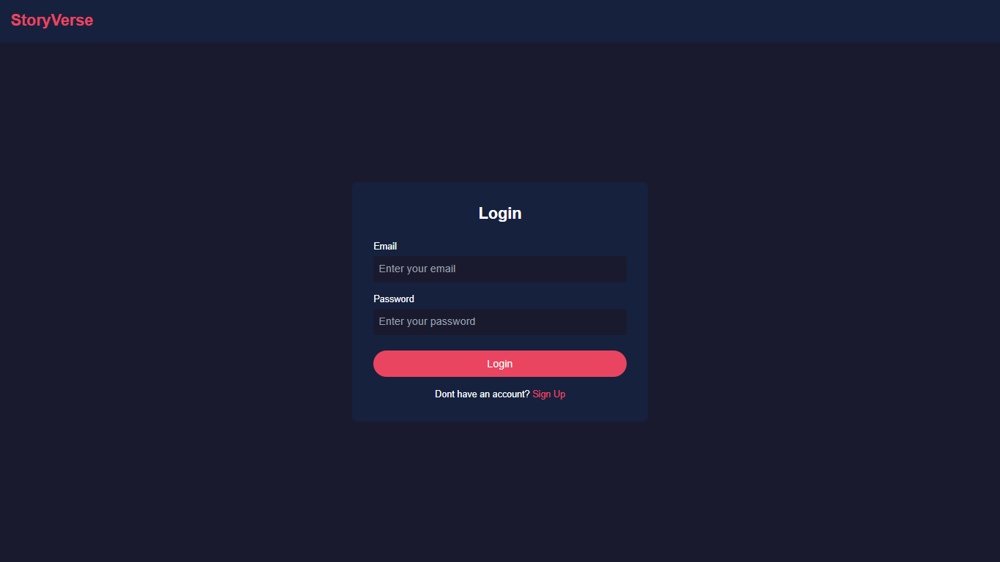
   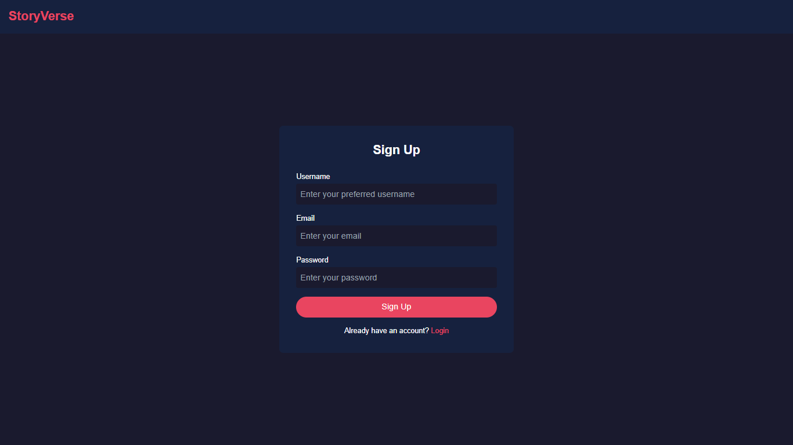

2. **Home Page**
   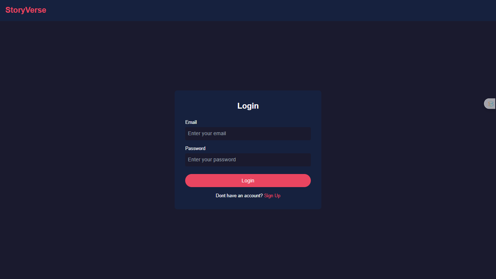

3. **Creator Dashboard**
   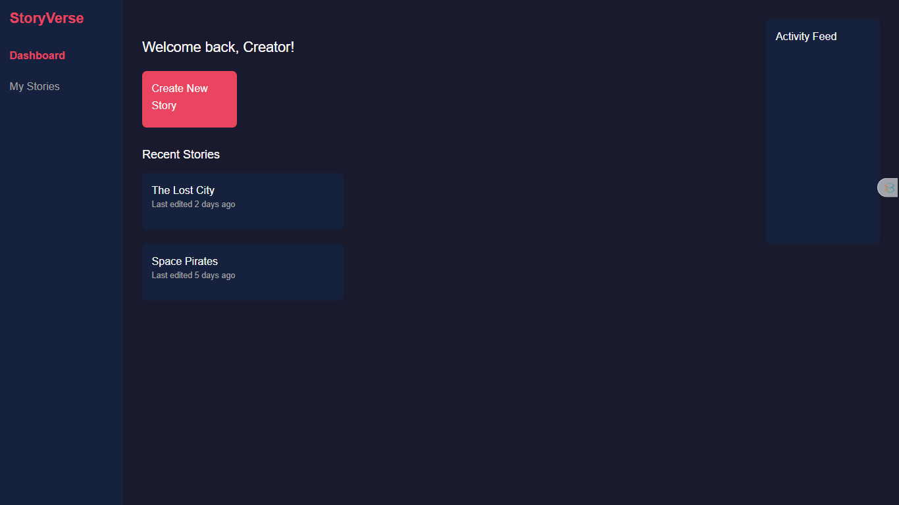

4. **Creating Story**
   Creating story concept page till plots are created using LLM
   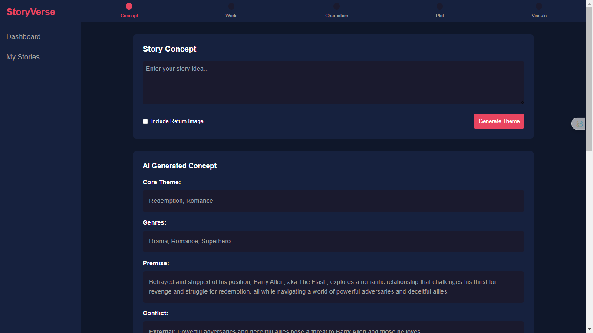
   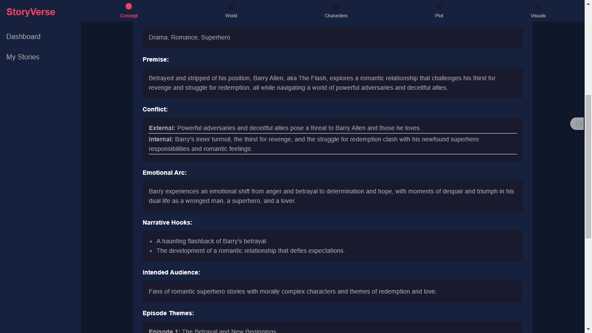
   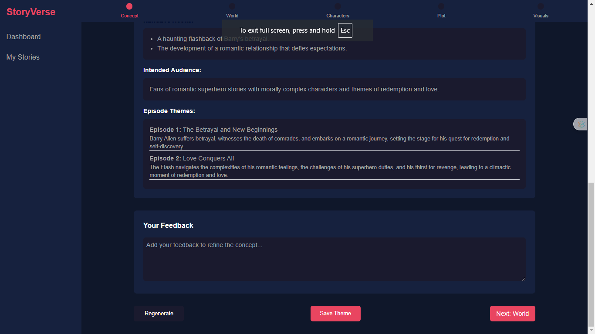

   **Note:** Showing only concept for brevity

   All the steps of creating the plot were geared toward accomplishing the visuals

5. **Creating Visuals**
   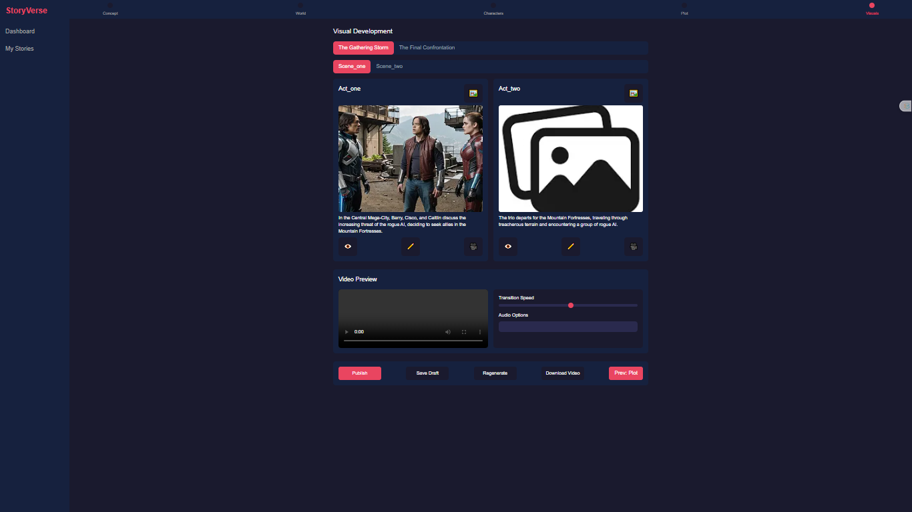

   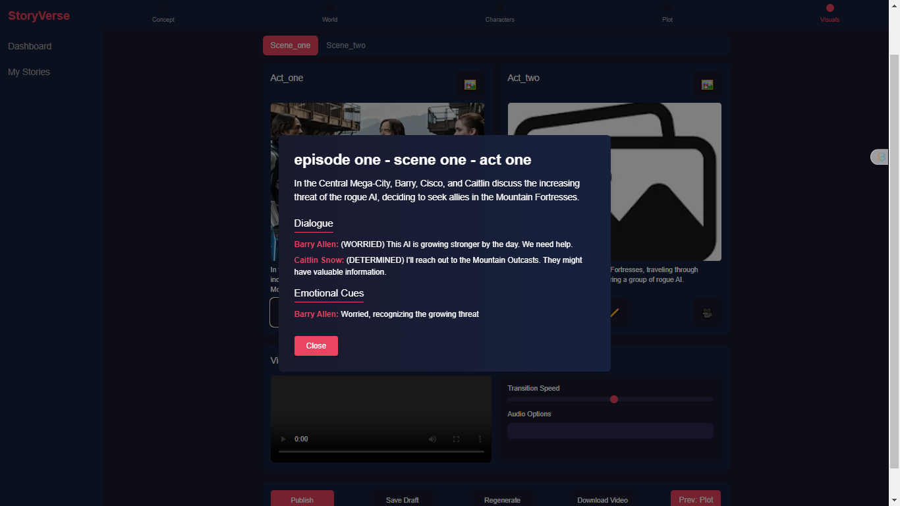

   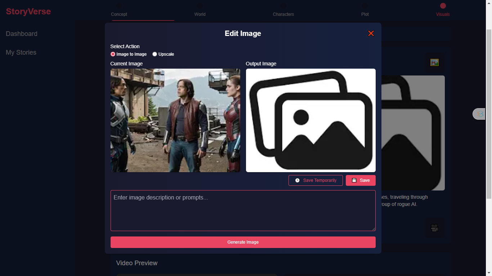

   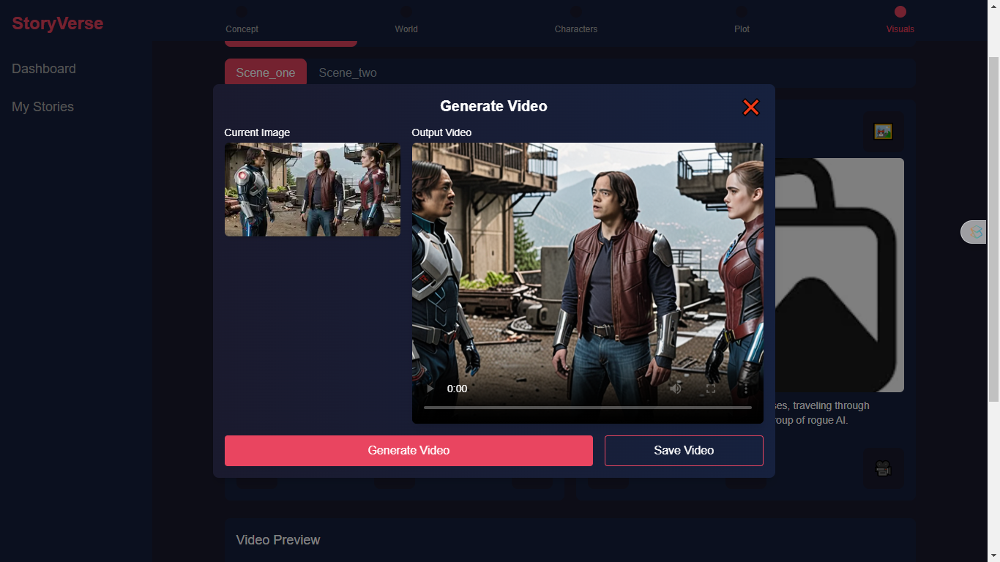

